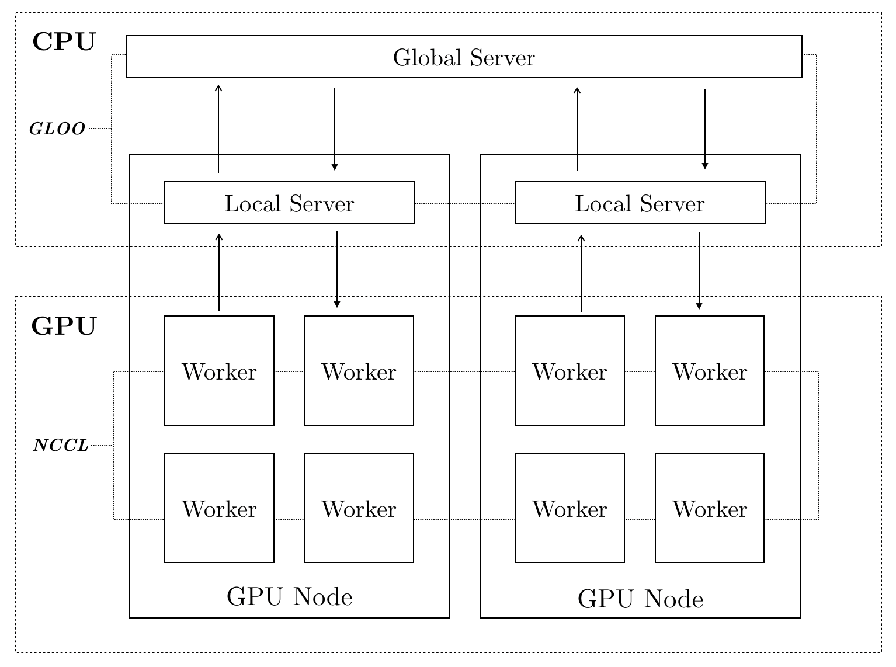
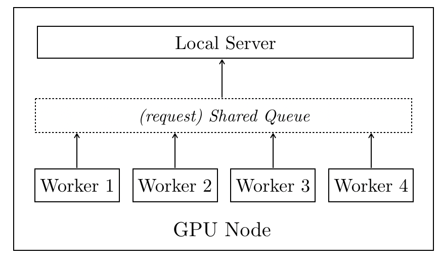
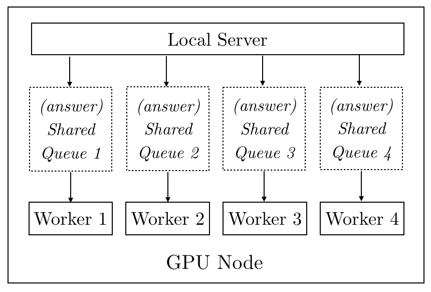
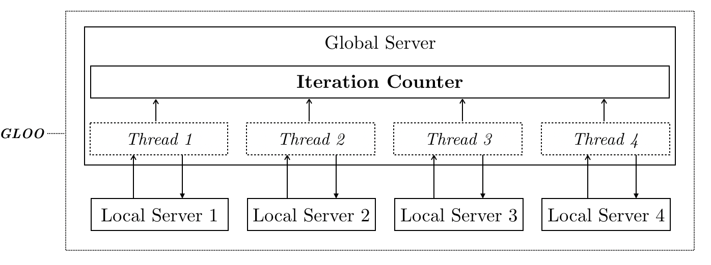

# Architecture

#### Process

The general training process can be described as the following:

At the beginning of each iteration, the local worker sends out a request to its local server and then the local server passes on the worker’s request to the global server. The global server checks the current status and replies to the local server. The local server passes on the global server’s message to the worker. Finally, depending on the message from the global server, the worker will choose to follow the local training or distributed training scheme.

#### Workers and their local server

More specifically, the communication between the local server and the workers is based on shared *queues*. For each worker, at the beginning of each iteration, it sends a requenst to local server and then waits for the answer.

The local server gets the answer from global server and puts the answer into the *queue* shared with the workers. Then the worker reads and follows the answer.

The advantage of using `queue` is that: (1) the number of request the local server paases on to the global server is always equal to the number of requests raised by workers (a shared tensor which stores the total number of requests from workers may induce inaccurate count as this number can be modified simutaneously by the workers) and (2) the worker waits until it gets the answer from the local server.

#### Local servers and global server

For each local server, the global server creates a thread for listening and responding to it. All the threads share a iteration counter which stores the total number of iterations of all workers after the last communication. Again, the data structure of iteration counter is a *queue* instead of a number or a single-value tensor as there is a chance that two or more threads can modify the value simutaneously. Althout due to *Global Interpreter Lock* the conflicts should not happen, in practice I found using *queue* is safer.

Each Node/Cluster/DevBox is usually provided with 4 GPUs (workers). We call all GPUs (workers) in the same Node/Cluster/DevBox as a group.
