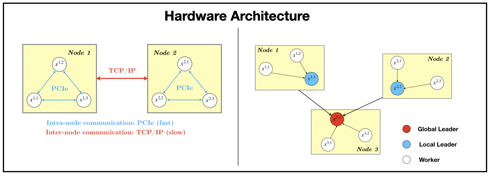
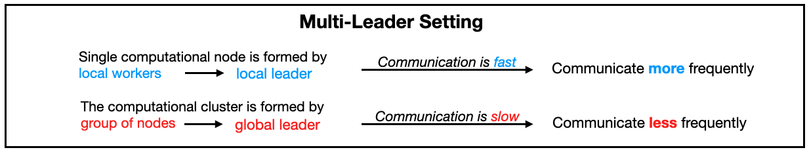
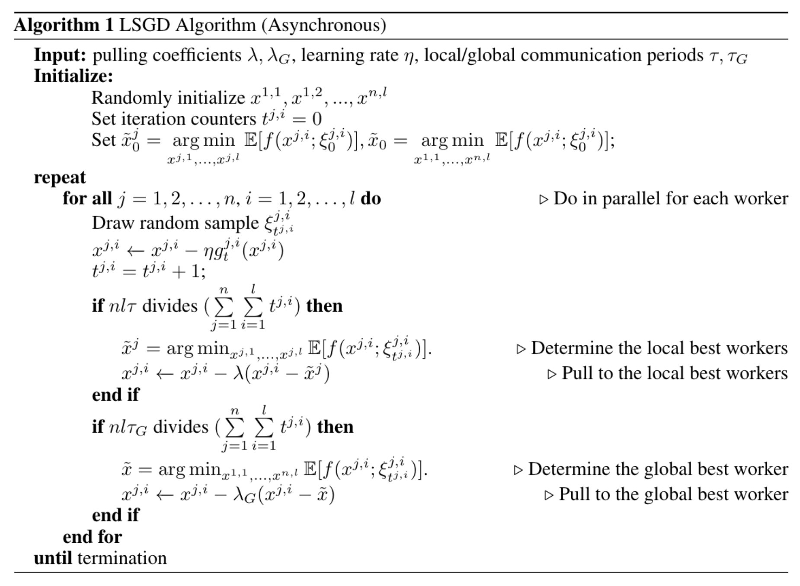

# Communication

### 1. Multi-Node Setting

We use LSGD as an example and consider distributed optimization under communication constraints for training deep learning models. The GPUs inside the same node are connected through PCIe and across nodes they commuicate through TCP/IP. Communicating through PCIe is *much* faster and more statble compared with TCP/IP. 

We propose a multi-leader setting well-aligned with the hardware architecture. We divide workers into different groups based on such physical structure and generate a local leader and a global leader for each worker.

### Asynchornous Collective Communication
The key idea for asynchornous training under the constrain of collective communication is that we consider the *total* number of iterations of all workers instead of a single worker like point-to-point communication. In other words, denoting the worker $j^{th}$ from $i^{th}$ group with iteration counter $t^{j,i}$, we are interested in

$$\text{total number of iterations} = \sum_{i=1}^l \sum_{j=1}^n t^{j,i}$$

For example, the algortihm of LSGD is

