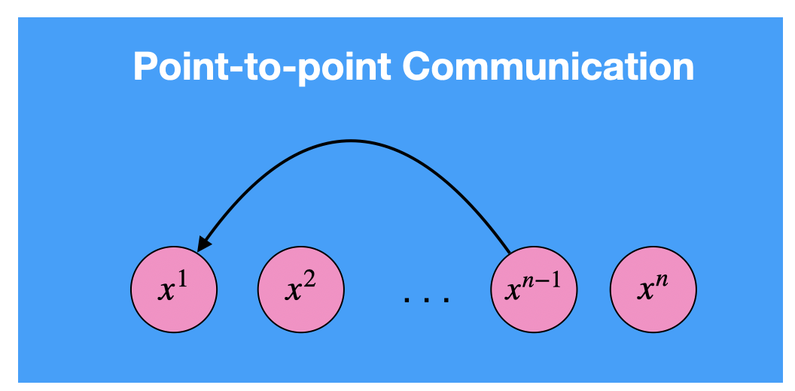
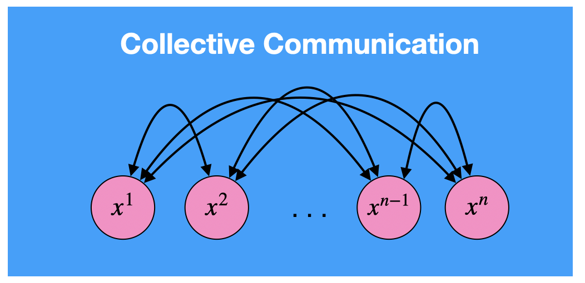
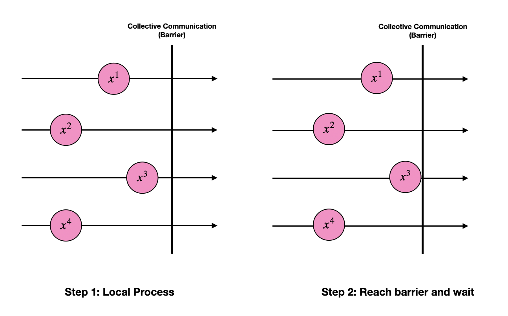
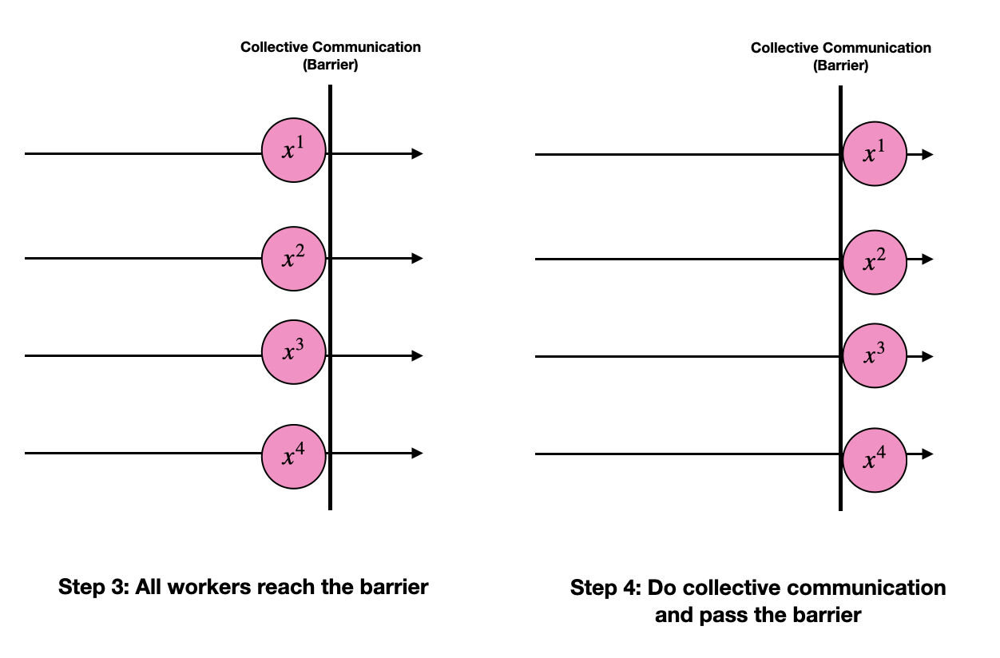

# Introduction
### Communicatoin Scheme

<figure markdown>
  { width="500" }
  <figcaption>Point-to-Point Communication (Flexible: from one worker to another)</figcaption>
</figure>

<figure markdown>
  { width="500" }
  <figcaption>Collective Communication (Efficient: all workers are involed)</figcaption>
</figure>

### How does *Collective Communication* work
{width="500", align=center}
{width="500", align=center}

### References
MPI Tutorial: https://mpitutorial.com/tutorials/