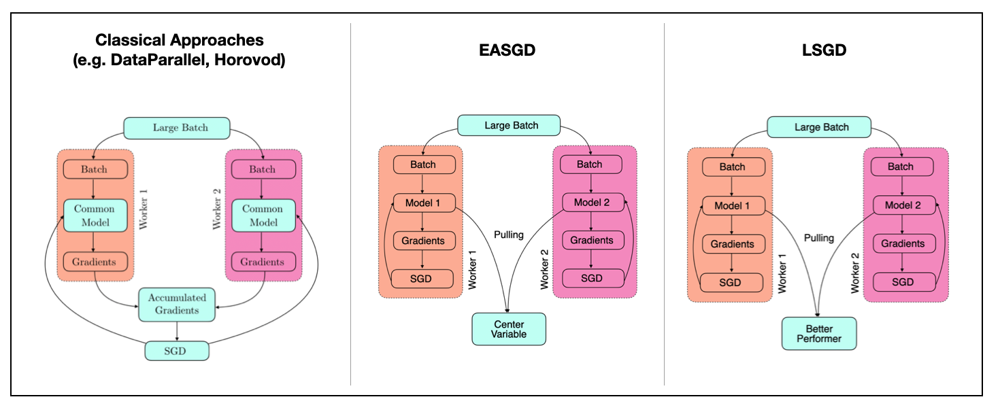
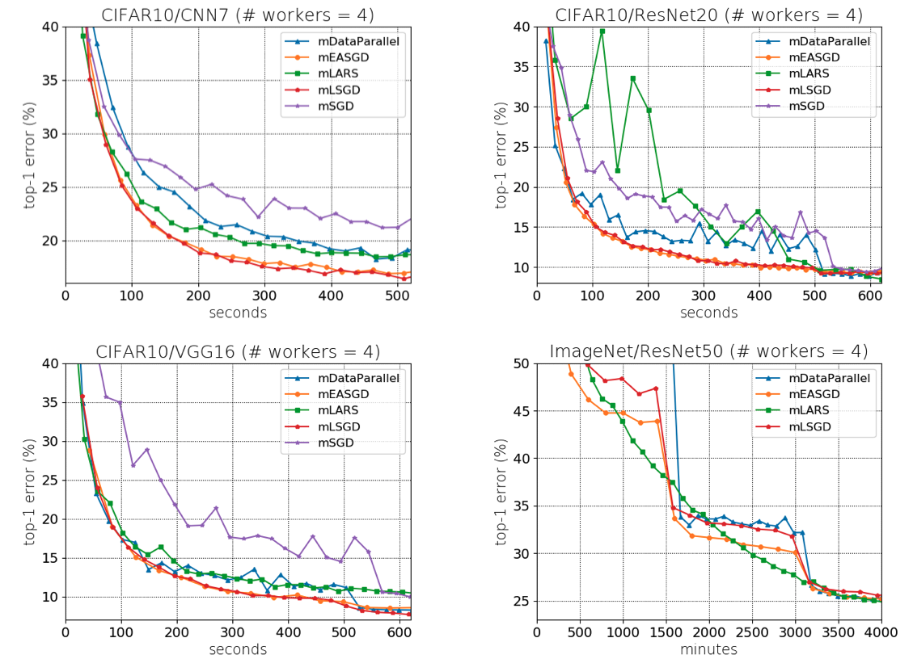
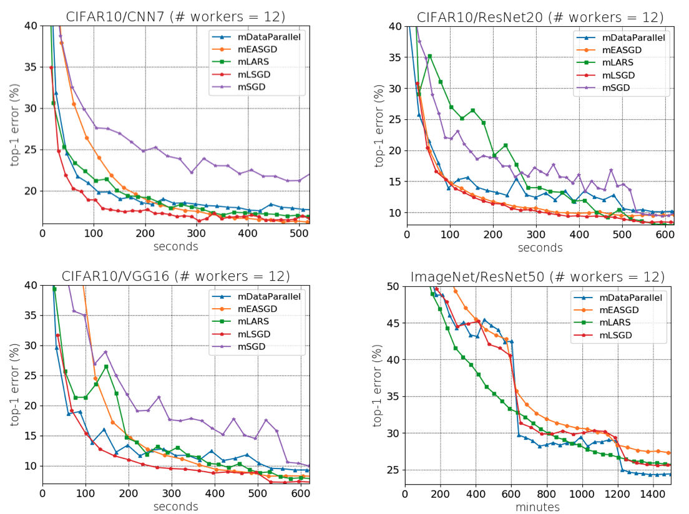

## Distributed Training

The goal of distributed training of deep learning models—to significantly **reduce the training time** of deep learning models without degrading their performance.

#### Pipelines

## Benchmarks

#### 4 workers (1 Server and 4 GTX-1080 on a single server)

#### 12 workers (3 Servers and 4 GTX-1080 on a single server)

